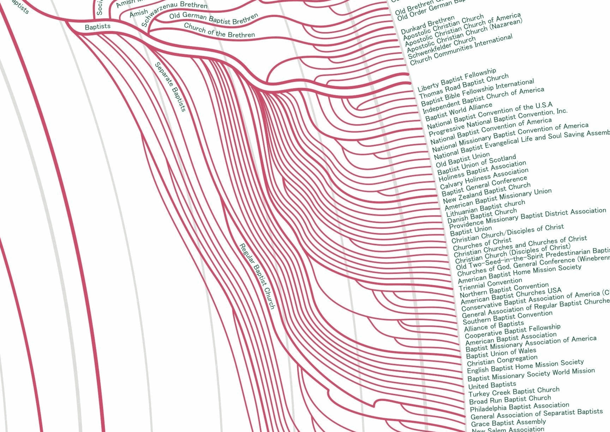
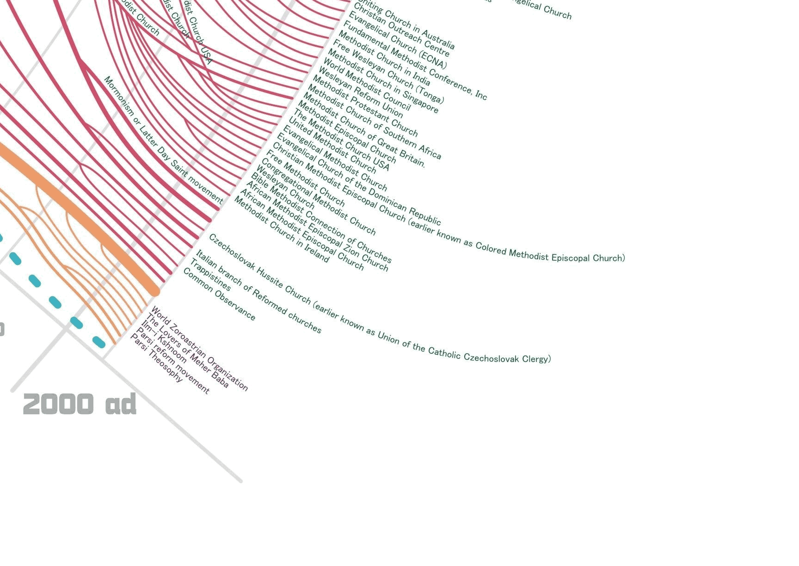

```{r setup, include=FALSE}
knitr::opts_chunk$set(echo = FALSE)
setwd("~/Documents/GitHub/Religion-in-America")

library(tidyverse) # For data wrangling
library(haven) # For data import 
```

In February of 2019, the United Methodist Church held a meeting in St. Louis to vote on whether clergy should be allowed to marry gay couples, or be gay themselves. The result, many fear, is that the church will split in two, as have the Anglicans and Presbyterians before them. 

A few thousand years prior, the Jewish sect that would become the Christian church was arguing about a very different question: Should  non-Jewish men be allowed to convert to Christianity without undergoing Jewish rituals, including the (very painful) ritual of male circumcision? 

The early church settled that debate, but for the next two thousand years, the story of Christianity would be a series of splits, both attempted and successful, over questions of both doctrine and authority. Some of those issues remain live wires. Others, however--like whether to circumcise Gentiles, or whether one should be able to rent a pew in church--are either long settled or irrelevant. Yet those historical splits, however, still shape the landscape of Christian denominations today.[^ARDA] Here are just some of the Baptists:

[^ARDA]: See http://thearda.com/denoms/families/trees/, which is probably what a tree should be built from. 




... and some of the Methodists: 



Perhaps there are some denominations that have more similar beliefs than their current positions on the Christian family tree might suggest. Is it possible to put back together what previous Christians have torn apart? To help denominations with similar belief sets find each other, work together and--maybe, just maybe--merge?

It just might be that data could help us get there. In 2014, the Pew Research Center's [Forum on Religion & Public Life](http://www.pewforum.org/) conducted a country-wide survey of religious belief in the United States. Pew researchers asked people all kinds of questions. They about their beliefs on everything from heaven and hell to abortion, and they asked about their religious practices, from attendace at religious services to how often they read religious texts. 

Thankfully for nerds, Pew does a wonderful job of [making their data available to the public](http://www.pewforum.org/datasets/), meaning that in addition to reading [the reports](http://www.pewforum.org/religious-landscape-study/) they write using the data, we can play with the data ourselves.

```{r data}
pew <- read_sav("data/Pew-Research-Center-2014-U.S.-Religious-Landscape-Study/Dataset - Pew Research Center 2014 Religious Landscape Study National Telephone Survey - Version 1.1 - December 1 2016.sav")
```

Pew interviewed over 35,000 people in 2015, and asked them dozens of questions. With a dataset that large, it makes sense to use a set of techniques called [machine learning](https://markclaytonhand.com/2018/12/11/python-for-beginners-part-ii-a-little-bit-about-machine-learning-but-dont-panic/). 

Machine learning techniques let us look for patterns in the data that might not otherwise exist. One kind of methods is called "trees", which locates and labels splits in the data. 

# A New Christian Family Tree? 

[Section here about trees. Build tree, identify current splits, identify denominations and faiths that are surprisingly similar]

```{r Belief and Practice, eval=FALSE}
# Choose subsets of questions with which to cluster respondents 
# names(pew)
# Looking at codebook and dataset together suggests: 
# - qa1:qb31 (then omit affiliation questions)
# - born (then omit)
# - attend:q14d
# - qk10:qm5g (then omit demographic and non-religious belief questions) 

# This cuts the data; I think instead we want "data" and "labels" per the ISL textbook.
# pew.small <- pew %>% select(resp,DENOM,qa1:qb31,born,attend:qi4d,qk10a:qm5g)

# dput() is a useful function for extracting variable names 
dput(names(pew))

# Attempting to create a list of variables with which to do stuff later, copypasted from the list generated by the previous command 
pew.data <- c("resp", "qa1", "qa2a", "qa2b", "qb1a", "qb1b", "qb1c", "qb2a", "qb2b", "qb2c", "qb2d", "qb20", "qb21", "qb22", "qb30", "qb30b", "qb31", "born", "attend", "qf2", "qf5", "qg1", "qg1b", "qg1c", "qg3", "qg5", "qg6", "qg7", "qg7b", "qh1", "qh2", "qh4", "qi1", "qi2a", "qi2b", "qi2c", "qi2d", "qi2g", "qi2h", "qi2m", "qi2t", "qi2u", "qi3", "qi3b", "qi4a", "qi4b", "qi4c", "qi4d","qk10a", "qk10b", "qk10c", "qk10d", "qm5a", "qm5b", "qm5d", "qm5e", "qm5f", "qm5g")
pew.labels <- pew$DENOM
pew.small <- pew[pew.data]
pew.small$DENOM <- pew.labels
#Messy, but I think that will work. 
``` 

```{r hierarchical, eval=FALSE}
hc.complete=hclust(dist(pew.small[pew.data]), method="complete")

# What does this do? Cut the tree? 
# hc.clusters <- cutree(hc.complete,4)

# Next two: 
# hc.average=hclust(dist(pew.small), method="average") 
# hc.single=hclust(dist(pew.small), method="single")

# This would organize the three plots 
# par(mfrow=c(1,3))

# Plot(s?) from above 
# plot(hc.complete, main="Complete Linkage", xlab="", sub="", cex =.9)
plot(hc.complete, labels=pew.labels, main="Complete Linkage", xlab="", sub="", ylab="")
# Moving in the right direction, but...

# Hold off on these
# plot(hc.average, main="Average Linkage", xlab="", sub="", cex =.9)
# plot(hc.single, main="Single Linkage", xlab="", sub="", cex =.9)

# https://stackoverflow.com/questions/33067547/how-to-substitute-na-by-0-in-20-columns 
# ? 
```

# Insert Clever Biblical Sounding Title About Clustering 

A second set of machine learning methods, called clustering, looks for patterns in the data that lets us group people together. 

[Section here about k-means clustering, what they are, the results, and what those implications are]

```{r kmeans, eval=FALSE}
# km.out=kmeans(pew.small,3,nstart=100)
# Immediate issue: kmeans doesn't work on observations with NAs, and every observation in this dataset has NAs in it. 
```


# Some other stuff to explore 

- Race
- Methodists (can we *see* the difference among Methodists, split them into two groups, and then suggest other faiths that the two halves would have an affinity with?)
- Catholicism (what to do with Catholics?)
- Region (could similar-enough groups merge based on lack of regional overlap?)
- Politics 
- Whether someone knows someone who is gay (a specific question in the survey)
- Economics 